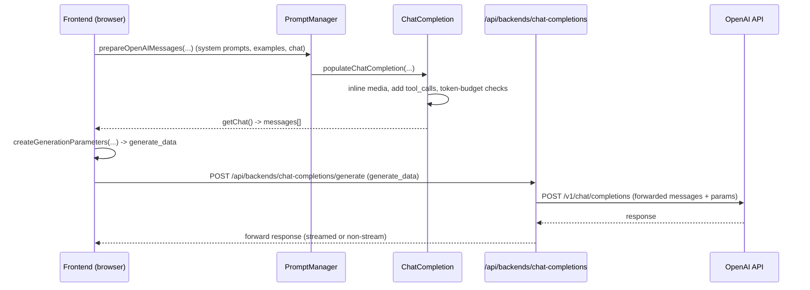

# OpenAI — ChatML message schema and conversion flow

This document describes the canonical ChatML-like message object used in SillyTavern and the conversion/forwarding flow for the OpenAI provider. It includes a concise sequence diagram and references to the implementation.

**Quick links**

- `prepareOpenAIMessages`: [public/scripts/openai.js](public/scripts/openai.js#L1433)
- `ChatCompletion.getChat`: [public/scripts/openai.js](public/scripts/openai.js#L3484)
- Chat generation endpoint handler: [src/endpoints/backends/chat-completions.js](src/endpoints/backends/chat-completions.js#L2008)
- Prompt conversion utilities (server): [src/prompt-converters.js](src/prompt-converters.js#L1-L1200)


**1) ChatML message object schema (canonical internal shape)**

SillyTavern uses a flexible message object throughout the frontend and backend. Typical properties:

- `role` (string): `'user' | 'assistant' | 'system' | 'tool'`
- `name` (optional string): name for example messages or speaker (e.g. `example_user` / `example_assistant`)
- `content` (string | ContentPart[]): message content. If complex/multimodal, `content` is an array of parts (see below).
- `tool_calls` (optional ToolCall[]): recorded function/tool calls attached to the message.
- `tool_call_id` (optional string): identifier for tool messages.
- `media` / `mediaDisplay` / `mediaIndex` (optional): media attachments metadata.
- `signature` (optional string): thought-signature / reasoning signature metadata.
- other provider-specific flags (e.g. `prefix`, `prefixProperty`) for special behaviours.

ContentPart union (examples used in code):

- Text part: `{ type: 'text', text: '...' }`
- Image part: `{ type: 'image_url', image_url: { url: 'data:...,base64', detail?: 'quality' } }`
- Video part: `{ type: 'video_url', video_url: { url: 'data:...,base64', detail?: 'quality' } }`
- Audio part: `{ type: 'audio_url', audio_url: { url: 'data:...,base64' } }`
- Tool call placeholder: `{ type: 'tool_call_id', tool_call_id: 'id', content: '...' }`
- Tool-calls bundle: `{ type: 'tool_calls', tool_calls: [ ... ] }`

ToolCall type (high-level):

- `{ id: string, type: 'function', function: { name: string, description?: string, parameters?: object, arguments?: any }, signature?: string }`

Example ChatML-style message (JSON):

```json
{
  "role": "user",
  "name": "Alice",
  "content": [
    { "type": "text", "text": "Show the picture I uploaded and then summarize it." },
    { "type": "image_url", "image_url": { "url": "data:image/png;base64,...", "detail": "auto" } }
  ]
}
```

Example assistant message with tool calls:

```json
{
  "role": "assistant",
  "content": [ { "type": "text", "text": "Calling OCR..." } ],
  "tool_calls": [ { "id": "tc1", "type": "function", "function": { "name": "ocr", "arguments": "{\"image\": \"data:...\"}" } } ]
}
```


**2) Frontend -> OpenAI flow (annotated walkthrough)**

1. User triggers generation in the UI (click/send/auto-continue).
2. Frontend collects conversation state and extensions: system prompts, story string, examples, pinned memory, quiet prompts, etc.
3. `prepareOpenAIMessages(...)` (see `public/scripts/openai.js` at [public/scripts/openai.js](public/scripts/openai.js#L1433)):
   - Merges system prompts with prompt-manager prompts.
   - Builds `Message` and `MessageCollection` objects.
   - Reserves token budget and inserts messages until budget is filled.
   - Inlines media (images/video/audio) into `Message.content` as `image_url`/`video_url`/`audio_url` parts using `Message.addImage`/`addVideo`/`addAudio`.
   - Converts tool invocations into `tool_calls` when needed (`Message.setToolCalls`).
4. `ChatCompletion` collects those `Message` instances and exposes a flattened chat via `ChatCompletion.getChat()` (see [public/scripts/openai.js](public/scripts/openai.js#L3484)). That returned array is the canonical messages array used to build the provider payload.
5. Frontend calls `createGenerationParameters(...)` which composes `generate_data` (model, temperature, max_tokens, `messages`, `chat_completion_source`, reasoning flags, json_schema, tool metadata, and provider-specific parameters).
6. Frontend sends `generate_data` to the SillyTavern backend at `POST /api/backends/chat-completions/generate` (see router at [src/endpoints/backends/chat-completions.js](src/endpoints/backends/chat-completions.js#L2008)).


**3) Backend handling and forwarding (server side)**

- The backend receives `generate_data` and inspects `chat_completion_source`.
- For `chat_completion_source === 'openai'`, the backend performs light adaptations (logprobs mapping, optional proxy settings, any `bodyParams` required) and forwards the payload to the OpenAI endpoint (`/v1/chat/completions`) largely as-is. See the OPENAI branch in the `/generate` handler: [src/endpoints/backends/chat-completions.js](src/endpoints/backends/chat-completions.js#L2008-L2068).
- For other providers the server may use `src/prompt-converters.js` to transform ChatML objects into provider-specific message shapes; for OpenAI the heavy lifting is done on the frontend.

Notes on flattening and provider compatibility:
- SillyTavern keeps a rich `content` representation (arrays of parts) so it can support inline multimodal parts and tool-call metadata.
- When the final provider requires plain text messages, SillyTavern will flatten or stringify parts appropriately (this happens inside the frontend `Message`/`ChatCompletion` logic and in provider-specific conversion code on the server when necessary).


**4) Minimal sequence diagram (mermaid)**




**5) Where to look in the code (key locations)**

- Frontend prompt assembly and OpenAI-specific flow: `public/scripts/openai.js` — `prepareOpenAIMessages` ([public/scripts/openai.js](public/scripts/openai.js#L1433)) and `ChatCompletion.getChat` ([public/scripts/openai.js](public/scripts/openai.js#L3484)).
- Frontend `Message` implementation (parts, `addImage`, `setToolCalls`): see `Message` class in `public/scripts/openai.js` around the `createAsync` / `ensureContentIsArray` methods.
- Backend router (entrypoint for generation): `src/endpoints/backends/chat-completions.js` (`router.post('/generate', ...)`) at [src/endpoints/backends/chat-completions.js](src/endpoints/backends/chat-completions.js#L2008).
- Prompt converters (server-side transforms used for non-OpenAI providers): `src/prompt-converters.js` — utilities such as `mergeMessages`, `convertTextCompletionPrompt`, etc. ([src/prompt-converters.js](src/prompt-converters.js#L1-L1200)).


**6) TL;DR (single paragraph)**

SillyTavern constructs a rich, ChatML-like message model in the frontend (text parts, media parts, tool-call metadata). For OpenAI the frontend composes full `messages[]` via `prepareOpenAIMessages` and `ChatCompletion.getChat`, packages them into `generate_data`, and posts to the local backend endpoint; the backend mostly forwards the OpenAI-style payload to OpenAI after small adjustments. For non-OpenAI providers the backend runs provider-specific conversions in `src/prompt-converters.js`.


---

File: [docs/openai-chatml-flow.md](docs/openai-chatml-flow.md)
